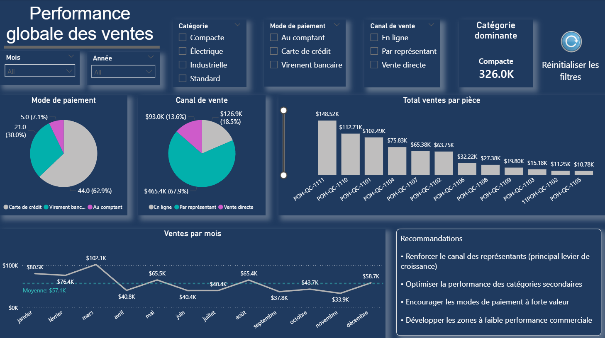
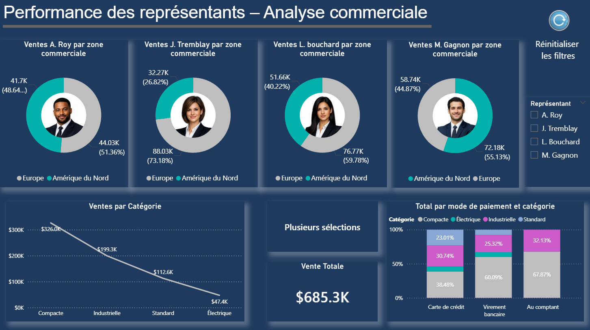
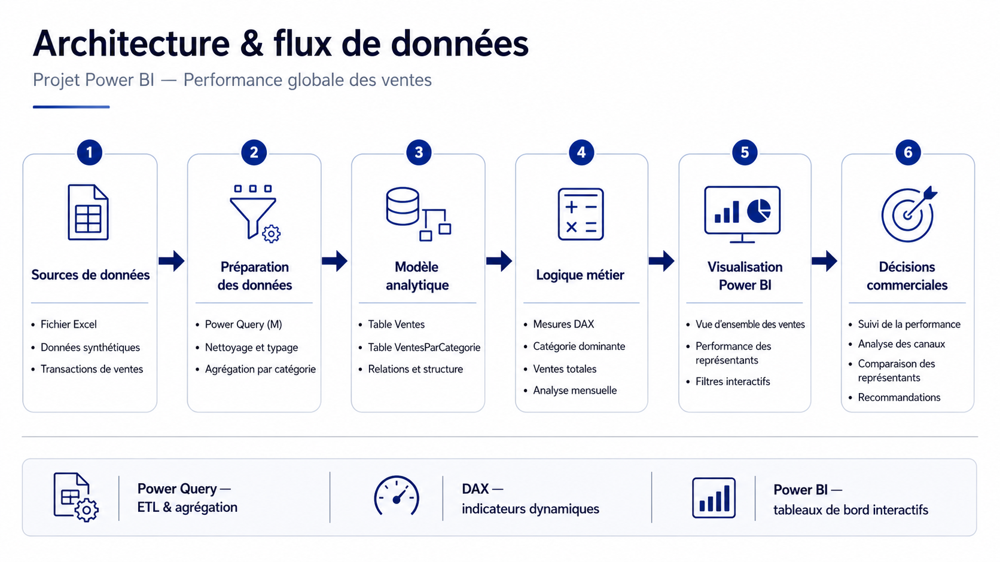
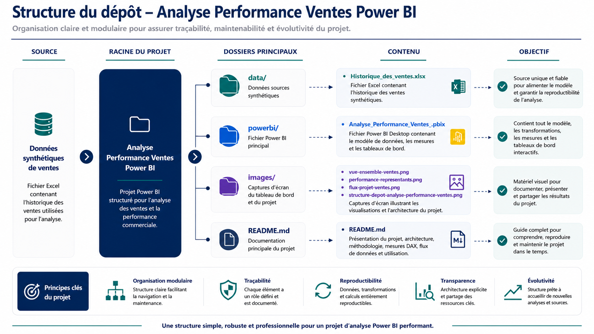

<div align="center">

# Performance globale des ventes

### *Transformer des données de ventes synthétiques en décisions commerciales concrètes*

<br/>

[](https://powerbi.microsoft.com)
[]()
[]()
[]()

<br/>

> **Données synthétiques. Analyse commerciale concrète.**  
> Ce projet démontre comment transformer des données de ventes en tableau de bord interactif pour suivre la performance globale, 
> analyser les canaux de vente et comparer la contribution des représentants.

</div>

---

## Contexte & problématique

Les équipes commerciales doivent souvent suivre plusieurs dimensions de performance en même temps :

| Enjeu commercial | Impact décisionnel |
|---|---|
| Manque de visibilité sur les ventes globales | Difficulté à identifier les principaux leviers de croissance |
| Analyse fragmentée par catégorie, canal et paiement | Décisions commerciales moins rapides |
| Suivi manuel des représentants | Comparaison limitée des performances individuelles |
| Faible lecture des tendances mensuelles | Difficulté à anticiper les périodes fortes et faibles |

**Ce tableau de bord centralise les indicateurs clés, facilite l’analyse commerciale et permet de prioriser les actions à partir de données synthétiques structurées.**

---

## Aperçu du tableau de bord

### Onglet 1 — Vue d’ensemble des ventes

> Analyse globale des ventes par mois, catégorie, canal de vente, mode de paiement et produit




**Lecture en 10 secondes :**

- La catégorie **Compacte** est la catégorie dominante avec **326,0 K$** de ventes
- Les ventes sont analysées par **catégorie**, **mode de paiement**, **canal de vente**, **mois** et **année**
- Le graphique mensuel met en évidence les variations de ventes au cours de l’année
- Les recommandations commerciales orientent l’utilisateur vers les principaux leviers d’action

---

### Onglet 2 — Performance des représentants

> Analyse comparative des ventes par représentant, zone commerciale, catégorie et mode de paiement



**Insights clés révélés :**

- Les ventes sont comparées par représentant à l’aide de visuels dédiés
- La répartition par zone commerciale met en évidence la contribution de l’Europe et de l’Amérique du Nord
- Le suivi par catégorie permet d’identifier les familles de produits les plus performantes
- Le graphique empilé montre la répartition des ventes par mode de paiement et catégorie
- La mesure de ventes totales permet de suivre rapidement la performance commerciale globale

---

## Architecture & flux de données

<p align="left">
  
</p>

<p align="left">
  <em>De la donnée synthétique à la décision commerciale — pipeline complet d’analyse des ventes</em>
</p>

---

## Flux analytique du projet

```mermaid
flowchart LR
    A[Données synthétiques de ventes] --> B[Nettoyage et typage des données]
    B --> C[Agrégation par catégorie]
    C --> D[Modèle de données Power BI]
    D --> E[Mesures DAX]
    E --> F[Tableaux de bord interactifs]
    F --> G[Analyse commerciale et recommandations]
````

---

## Capacités techniques démontrées

### Power Query — Transformation & agrégation

* Transformation des types de données
* Agrégation des ventes par catégorie
* Création d’une table intermédiaire dédiée à l’analyse
* Préparation des données pour les mesures DAX
* Structuration des données pour faciliter l’analyse commerciale

Exemple de code Power Query utilisé pour générer une table avec les totaux par catégorie :

```m
let
    // Source de données
    Source = Ventes,

    // Transformation des types de données
    TypesModifiés = Table.TransformColumnTypes(
        Source,
        {
            {"Catégorie", type text},
            {"Total", type number}
        }
    ),

    // Agrégation des ventes par catégorie
    VentesParCategorie = Table.Group(
        TypesModifiés,
        {"Catégorie"},
        {
            {
                "TotalVentes",
                each List.Sum([Total]),
                type number
            }
        }
    )
in
    VentesParCategorie
```

---

### DAX — Mesures analytiques

Le tableau de bord utilise des mesures DAX pour identifier dynamiquement la catégorie dominante.

Exemple de mesure DAX utilisée :

```dax
Nom Top 1 Catégorie = 
VAR MontantMax =
    MAX ( VentesParCategorie[TotalVentes] )
RETURN
    CONCATENATEX (
        FILTER (
            VentesParCategorie,
            VentesParCategorie[TotalVentes] = MontantMax
        ),
        VentesParCategorie[Catégorie],
        ", "
    )
```

Cette mesure permet d’afficher automatiquement la catégorie générant le plus grand montant de ventes, sans saisie manuelle.

---

### Conception du tableau de bord

* Deux onglets complémentaires : vue globale et analyse par représentant
* Filtres dynamiques par mois, année, catégorie, mode de paiement, canal de vente et représentant
* Cartes KPI pour les indicateurs clés
* Graphiques de répartition par canal, mode de paiement et catégorie
* Analyse temporelle des ventes mensuelles
* Visuels comparatifs pour les représentants commerciaux
* Bouton de réinitialisation des filtres pour faciliter la navigation

---

## Structure du rapport

### 1. Vue d’ensemble des ventes

Cette page répond à la question :

> **Quels sont les principaux leviers de performance commerciale globale ?**

Elle inclut :

* Catégorie dominante
* Ventes par mois
* Total des ventes par produit
* Répartition par mode de paiement
* Répartition par canal de vente
* Recommandations commerciales

---

### 2. Performance des représentants

Cette page répond à la question :

> **Quels représentants et quelles zones commerciales contribuent le plus aux ventes ?**

Elle inclut :

* Ventes par représentant
* Répartition Europe / Amérique du Nord
* Ventes par catégorie
* Ventes totales
* Répartition par mode de paiement et catégorie
* Filtre dynamique par représentant

---

## Résultats & impact simulé

| Indicateur                  | Valeur               |
| --------------------------- | -------------------- |
| Catégorie dominante         | Compacte             |
| Ventes catégorie dominante  | 326,0 K$             |
| Ventes totales              | 685,3 K$             |
| Moyenne mensuelle           | 57,1 K$              |
| Meilleure période mensuelle | Mars                 |
| Principal canal de vente    | Par représentant     |
| Projet                      | Données synthétiques |

---

## Recommandations commerciales

À partir des visualisations, le rapport met en évidence plusieurs pistes d’action :

* Renforcer le canal des représentants, principal levier de croissance
* Optimiser la performance des catégories secondaires
* Encourager les modes de paiement à forte valeur
* Développer les zones à faible performance commerciale
* Suivre les variations mensuelles afin d’anticiper les périodes fortes et faibles

---

## Pourquoi ce projet se distingue

Ce projet ne se limite pas à un rapport visuel. Il démontre une approche complète de l’analyse commerciale :

* **Vision exécutive** : indicateurs clés visibles rapidement
* **Analyse opérationnelle** : comparaison par représentant et par zone commerciale
* **Modélisation analytique** : utilisation de Power Query et DAX pour créer des indicateurs dynamiques
* **Storytelling commercial** : chaque page répond à une question de gestion précise
* **Expérience utilisateur** : filtres, bouton de réinitialisation et navigation claire

---

## Architecture du projet

Cette vue illustre l’organisation globale du projet, structurée autour du fichier Power BI, des données synthétiques, des captures d’écran et des actifs de documentation.

## Architecture du projet

<p align="left">
  
</p>

<p align="left">
  <em>Organisation modulaire du projet Power BI — structure des données, fichiers analytiques et documentation.</em>
</p>

---

## Utilisation

```bash
# 1. Cloner le dépôt
git clone https://github.com/victorgvc-hes/powerbi-sales-performance-dashboard.git

# 2. Ouvrir le fichier dans Power BI Desktop
#    File > Open > Analyse_Performance_Ventes_Entreprise_PowerBI.pbix

# 3. Si nécessaire, actualiser la source de données
#    Home > Transform Data > Data Source Settings
```

**Prérequis** : [Power BI Desktop](https://powerbi.microsoft.com/fr-fr/desktop/) gratuit

---

## 👤 Auteur

<div align="center">

**Victor Vergara**

*Professionnel des achats et des opérations | 20+ ans en chaîne d'approvisionnement*
*Spécialisation : analytique avancée • Power BI • transformation numérique • amélioration opérationnelle*

[](https://www.linkedin.com/in/victor-vergara075/)
[](https://github.com/victorgvc-hes?tab=repositories)
[](mailto:victorgvc@gmail.com)

</div>

---

<div align="center">

*Ce projet fait partie d'un portefeuille de projets appliqués combinant expertise opérationnelle, analytique avancée et intelligence d’affaires.*

</div>
